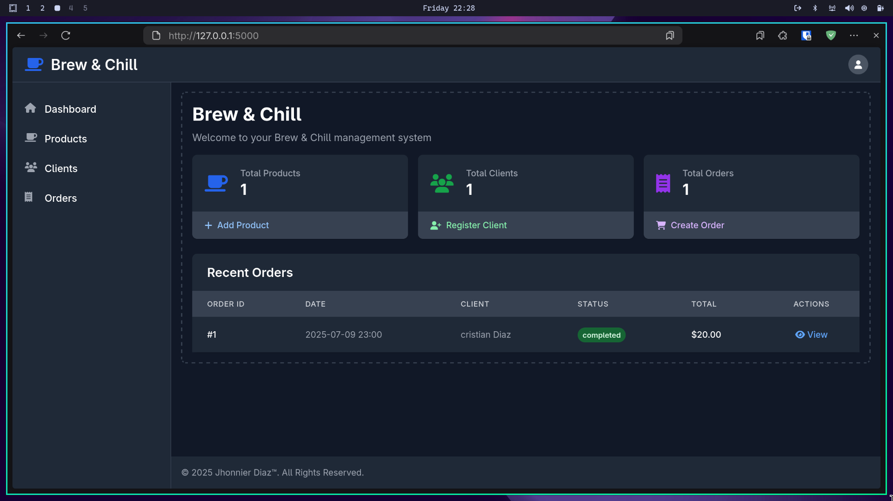

# Brew and Chill

[**Live Demo**](https://github.com/Jhonnikek/brew-and-chill)  

A simple CRUD for a restaurant, developed with **Flask** and **SQLite**.  
It allows managing menus, customers, and orders in an easy and organized way.  

---

## Tech Stack

- **Backend:** Flask (Python)  
- **Database:** SQLite  
- **Frontend:** HTML, TailwindCss (Flask templates)  

---

## Features

- Manage menus (create, read, update, delete dishes)  
- Manage customers (register and update customer information)  
- Handle orders linked to menus and customers  
- Lightweight SQLite database for easy setup  
- Clean and minimal interface  

---

## Screenshots
  

---

## Getting Started

Follow these steps to run the project locally:

### 1. Clone the repository
```bash
git clone https://github.com/Jhonnikek/brew-and-chill.git
cd brew-and-chill
```

### 2. Create a virtual environment
```bash
python -m venv env
source env/bin/activate   # On Linux/Mac
env\Scripts\activate #Windows
```
### 3. Install dependencies
```bash
pip install -r requirements.txt
```
### 3. Install dependencies
```bash
pip install -r requirements.txt
```

### 4. Run the server
```bash
flask run
```
## License [MIT](https://choosealicense.com/licenses/mit/)